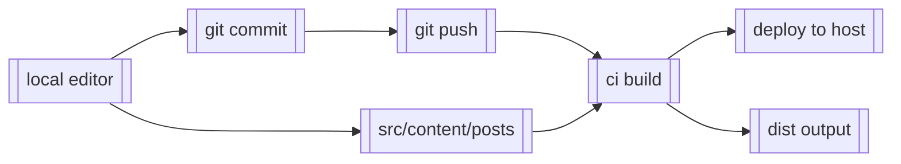

# Gitops Notes

This repository is a small journal of notes and experiments about using gitops and devops tools. It is built with Astro and serves a simple static site.

## Why this exists

I prefer to keep my writing in plain text and under version control instead of inside a hosted blog platform. That makes the content easy to edit, review, and restore using the same tools I use for code.

The site is generated from the same repo that stores the notes. When I push a change, CI builds the site and deploys it automatically. That means the published site is always a direct reflection of the git history.

This setup also makes it easier to experiment with tooling, reuse code, and understand the full build pipeline. The “blog” is really just a set of markdown files and a build process, so I can treat it like any other gitops project.

## How this site is structured

The site content lives under `src/content`. Each post is a markdown file in `src/content/posts`.

Each post file uses frontmatter for its title and date. When the site builds, Astro reads those files and renders them into pages.

The layout and page templates are in `src/layouts` and `src/pages`.

## how to add a note

1. create a new file in `src/content/posts`.
2. start with frontmatter including a title and a date.
3. write your content in markdown below the frontmatter.

## How this fits into a gitops workflow

This repo is the source of truth for the notes. You edit files locally, commit changes, and push them to the remote.

A build process (CI) can run `npm run build` and deploy the generated output to a static hosting provider.

